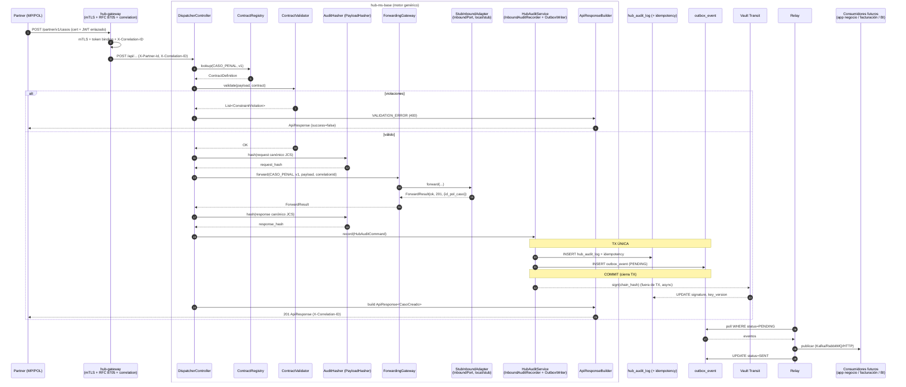

# ADR-0006 — Modelo de hub e interoperabilidad genérica

**Estado**: Aceptado
**Fecha**: 2026-06-23
**Autores**: Equipo Síntesis
**Relacionados**: ADR-0001 (interop hub), ADR-0004 (eliminación QR), ADR-0005 (contrato ApiResponse)

---

## 1. Contexto y pregunta que resuelve este ADR

El proyecto dejó de ser un middleware de decodificación de QR (ADR-0004) para
convertirse en un **hub de interoperabilidad** entre la empresa y terceros del
Estado (Ministerio Público, Policía/FELCN), con la infraestructura transversal
ya definida en el ADR-0001 (mTLS + RFC 8705, auditoría con cadena de hashes,
outbox para facturación, adaptadores por proveedor) y el contrato de respuesta
universal del ADR-0005 (`ApiResponse<T>`).

El **primer caso de uso real** es el envío de **casos penales** desde el MP (o la
Policía) hacia el hub: el hub recibe el caso, lo valida, lo audita+hashea, lo
registra y lo reenvía a la **app de negocio interna**. Esa app **todavía no
existe**, por lo que hoy el hub reenvía a un *stub/dummy*.

La infraestructura ya construida (sin cambios en este ADR):

- `hub_audit_log` — tabla particionada por mes, append-only, cadena de hashes
  SHA-256 por partner (`prev_hash` → `chain_hash`), firma con Vault Transit
  (`signature`, `key_version`).
- `hub_audit_idempotency` — tabla de lookup que materializa el UNIQUE global de
  `idempotency_key` (la tabla particionada no puede tenerlo directamente).
- `outbox_event` — patrón outbox transaccional (at-least-once + idempotencia por
  `idempotency_key` UNIQUE, estados `PENDING/SENT/FAILED`).
- `hub_measurement` — medición/facturación.
- `provider` + `provider_credential_ref` — catálogo de proveedores externos con
  referencia a Vault.
- `caso` (`v2/0005-caso.xml`, **aún sin aplicar**) — tabla de dominio del primer
  caso de uso (campos `cud`, `id_externo_caso`, `relato`, `tags`, etc.).
- `HubAuditInterceptor` — interceptor MVC en pausa, escrito originalmente para
  envolver `POST /api/qr/decode`; espera reorientación al flujo de casos.
- `EfxRateAutoConfiguration` / `EfxRateAdapter` — adaptador **outbound** ya
  existente (patrón puerto-adaptador hacia afuera, con su `canonical/*Request`).
- ADR-0005 — `ApiResponse<T>` como contrato universal de respuesta.

**La pregunta concreta que este ADR responde**, planteada por el equipo:

> Cada vez que aparezca una API nueva que el hub deba exponer hacia un tercero (o
> recibir desde un tercero), ¿hay que **programar un controller y un DTO nuevos**?
> ¿O el hub puede ser **genérico** y solo configurarse?

La respuesta corta (desarrollada en §4): **no se programa un controller por API
nueva.** Agregar una API = **declarar su contrato de validación** + **configurar
su destino** + **escribir/registrar su adaptador de destino**. El controller, el
pipeline de auditoría, el hashing, el outbox y la construcción de `ApiResponse`
se construyen **una sola vez** (§5).

---

## 2. Modelo A confirmado: hub intermediario

El equipo confirmó el **Modelo A — hub intermediario**. Sus reglas:

1. **El hub NO modela la lógica de negocio de cada API.** No conoce la semántica
   de un caso penal más allá de lo necesario para validar su forma y rutearlo.
   La **app de negocio interna es dueña de la lógica** (qué se hace con el caso,
   cómo se persiste el dominio, qué reglas aplica).
2. **El hub es el único punto de entrada/salida** (ADR-0001) y aplica de forma
   transversal: mTLS + RFC 8705, validación de forma, auditoría + hash con
   cadena, registro de evidencia, medición/facturación y reenvío.
3. **Responsabilidad del hub por transacción inbound**: recibir → validar forma →
   canonicalizar + hashear → reenviar al destino → auditar (cadena + firma) →
   escribir outbox → responder `ApiResponse<T>`.
4. **Lo que el hub NO hace**: no decide reglas de negocio, no es la base de datos
   de verdad del dominio, no orquesta workflows de negocio. Si mañana el caso
   penal cambia su flujo interno, eso vive en la app de negocio, no en el hub.

Consecuencia de diseño central: **el hub es un motor de paso instrumentado**, no
una colección de microservicios de dominio. Esto hace viable que el grueso del
código sea **genérico** y reusable por cualquier producto (`product`).

---

## 3. Comparación de opciones de implementación

Criterios: (a) facilidad para agregar una API nueva, (b) calidad de validación,
(c) mantenibilidad, (d) riesgo, (e) alineación con Modelo A.

### Opción 1 — Un controller + DTO por cada API

Cada producto tiene su `@RestController`, su DTO `@Valid` con Bean Validation y
su servicio. Para agregar `POST /casos` se escribe `CasoController`,
`CasoRequest` (anotado), `CasoService`, y se cablea el pipeline de auditoría a
mano (como hace hoy `HubAuditInterceptor` para QR).

| Criterio | Evaluación |
|---|---|
| Agregar API nueva | **Costoso**: clase controller + DTO + tests + recableado de auditoría por endpoint. |
| Validación | **Fuerte y en tiempo de compilación** (Bean Validation, tipos Java). |
| Mantenibilidad | **Baja a escala**: N productos = N controllers casi idénticos salvo el DTO; el pipeline transversal se duplica o se mete en interceptores frágiles. |
| Riesgo | Divergencia entre controllers (cada uno audita "a su manera"); fácil olvidar el outbox o el hash en uno nuevo. |
| Alineación Modelo A | **Baja**: empuja a meter lógica de dominio en el hub (validaciones ricas, mapeos), justo lo que el Modelo A prohíbe. |

### Opción 2 — Controller genérico de reenvío + tabla de ruteo

Un único controller recibe todo, mira una tabla de ruteo (`product` → URL
destino) y hace *pass-through* puro. Agregar una API = un INSERT en la tabla de
ruteo. **Sin validación de campos.**

| Criterio | Evaluación |
|---|---|
| Agregar API nueva | **Trivial**: configuración en DB, cero código. |
| Validación | **Nula**: el hub reenvía basura; los errores de forma se descubren recién en el destino (o en el partner del MP, que devuelve su propio sobre no estándar). |
| Mantenibilidad | Alta en cantidad de código, pero **baja en confiabilidad**: el hub no puede garantizar nada de lo que pasa por él. |
| Riesgo | **Alto**: el hub firma y audita payloads que ni siquiera validó; un caso malformado se propaga al outbox y a facturación. Contradice "auditar evidencia confiable" del ADR-0001. |
| Alineación Modelo A | Parcial: es intermediario, pero un intermediario **ciego**. El Modelo A pide validar forma, no solo pasar. |

### Opción 3 — Controller genérico + validación por contrato cargado por API

Un único controller (`DispatcherController`) recibe todos los requests inbound.
La validación **no** vive en un DTO compilado por endpoint, sino en un
**contrato declarado** (`ContractDefinition`) cargado en un registro
(`ContractRegistry`), indexado por `(product, version)`. Un `ContractValidator`
aplica el contrato y produce violaciones. El destino se resuelve por un
`ForwardingTarget` configurado y un **adaptador de destino** (`InboundPort`).

| Criterio | Evaluación |
|---|---|
| Agregar API nueva | **Bajo costo**: declarar `ContractDefinition` + registrar `ForwardingTarget` + escribir el adaptador de destino. **Sin controller nuevo.** |
| Validación | **Fuerte** (requerido, tipos, longitudes, formatos), aplicada de forma uniforme. Se pierde la validación en *tiempo de compilación* (mitigable con contract tests, §8). |
| Mantenibilidad | **Alta**: el pipeline transversal (auditoría, hash, outbox, `ApiResponse`) se escribe una vez; cada producto es datos + un adaptador delgado. |
| Riesgo | **Medio**: complejidad del registro de contratos y riesgo de divergencia contrato↔ficha (mitigable, §14). |
| Alineación Modelo A | **Alta**: el hub valida forma y rutea, pero **no modela negocio**; la lógica vive detrás del `InboundPort`, en la app de negocio. |

---

## 4. Decisión: Opción 3

Se adopta la **Opción 3 — controller genérico con validación por contrato**.

Es el punto medio correcto para un **hub intermediario (Modelo A)**:

- Conserva la garantía dura del ADR-0001 (auditar y firmar **evidencia
  confiable**): el hub solo audita/hashea/rutea lo que **pasó la validación de
  forma**. No es un pasamanos ciego como la Opción 2.
- No arrastra a meter lógica de dominio en el hub (problema de la Opción 1): el
  contrato describe **forma**, no **reglas de negocio**; la lógica está detrás
  del `InboundPort`.
- Hace que el costo de un producto nuevo sea **declarativo**, no estructural: el
  motor (§5) ya existe; solo se le "enseña" un producto nuevo (§6).

**Respuesta a la pregunta del equipo (§1):** **No** se programa un controller por
API nueva. Agregar una API nueva =

1. **declarar** su `ContractDefinition` (forma + reglas de validación),
2. **configurar** su destino (`ForwardingTarget` → qué adaptador), y
3. **escribir/registrar** el adaptador de destino (`InboundPort`), que hoy apunta
   al stub y mañana a la app real.

El `DispatcherController`, el `ContractValidator`, el `AuditHasher`, el
`ChainHashService`, el `ForwardingGateway`, el `InboundAuditRecorder`, el
`OutboxWriter` y el `ApiResponseBuilder` **no se tocan** al agregar un producto.

**Alternativas descartadas**: Opción 1 (no escala, empuja dominio al hub) y
Opción 2 (auditar evidencia no validada viola el ADR-0001 y deja el hub ciego).

---

## 5. Motor genérico — qué se construye UNA SOLA VEZ

Todos estos componentes son **transversales**: aplican a **toda** transacción
inbound, independientemente del `product`. Se implementan una vez y no cambian al
agregar productos. (Paquete sugerido: `bo.com.sintesis.hub.base.hub.inbound`,
respetando los nombres heredados.)

| Componente | Tipo | Responsabilidad |
|---|---|---|
| **CorrelationIdFilter** | `Filter` / `OncePerRequestFilter` con `HIGHEST_PRECEDENCE` | Lee `X-Correlation-ID` del request o **genera un UUID**; lo pone en MDC y como request attribute; lo escribe en el header de respuesta. **Corre antes de seguridad** (ADR-0005 §5). En el gateway hay su equivalente WebFlux. |
| **mTLS + RFC 8705 token binding** | (Gateway) | El gateway exige certificado de cliente de la PKI de Vault y verifica que el `cnf.x5t#S256` del JWT case con el thumbprint del cert. Propaga `X-Partner-Id` derivado del cert hacia el microservicio. No vive en ms-base; es el borde (ADR-0001 §1, ADR-0005 §6.1). |
| **DispatcherController** | `@RestController` único | Recibe **todos** los requests inbound de producto. Extrae `(product, version)` de la ruta/headers, lee el body como `Map<String,Object>` (JSON genérico), y orquesta el pipeline. No tiene lógica por producto. |
| **ContractRegistry** | `@Component` (registro en memoria) | Mantiene los `ContractDefinition` indexados por `(product, version)`. `lookup(product, version)` → `Optional<ContractDefinition>`. Si no hay contrato → 404/400 controlado (`RESOURCE_NOT_FOUND` o `PRODUCT_NOT_AUTHORIZED`). Se llena en arranque desde código y/o YAML. |
| **ContractValidator** | `@Component` | Aplica un `ContractDefinition` al payload y devuelve `List<ConstraintViolation>` (mismos `{field, message}` del ADR-0005). No conoce productos concretos: itera reglas declaradas. |
| **AuditHasher** | (existe: `PayloadHasher`) | Canonicaliza (RFC 8785 / JCS) y calcula SHA-256 hex del request y del response. Ya implementado y usado por `EfxRateAdapter` y `HubAuditInterceptor` (`hash` / `hashRaw`). |
| **ChainHashService** | (parte de `HubAuditService`) | Calcula `chain_hash = SHA-256(prev_hash ‖ request_hash ‖ response_hash ‖ ts ‖ partner_id)` leyendo el `prev_hash` del último registro del partner. Génesis documentado en `0001-hub-audit-log.xml`. |
| **ForwardingGateway** | `@Component` | Resuelve el `ForwardingTarget` para `(product, version)` y delega en el `InboundPort` correspondiente. Mide latencia. Traduce excepciones del puerto a códigos canónicos (`UPSTREAM_ERROR`/`UPSTREAM_TIMEOUT`/`SERVICE_UNAVAILABLE`). |
| **InboundAuditRecorder** | (existe: `HubAuditService.record`) | Escribe el registro en `hub_audit_log` (append-only) + el lookup en `hub_audit_idempotency`. |
| **OutboxWriter** | (parte de `HubAuditService.record`) | Escribe el evento en `outbox_event` **en la misma transacción** que el audit log. `HubAuditCommand` ya transporta `aggregateType`, `aggregateId` y `outboxPayload`. |
| **ApiResponseBuilder** | `@Component` | Construye el `ApiResponse<T>` del ADR-0005 (success/status/message/data/error/correlation_id/timestamp). Único serializador de respuesta inbound. |

> Nota sobre `HubAuditService`: hoy ya recibe un `HubAuditCommand` con request
> hash, response hash, idempotency_key, correlation_id, aggregate y outbox
> payload, y persiste auditoría + outbox transaccionalmente. El motor genérico
> **reutiliza** este servicio; no se reescribe.

---

## 6. Por cada API nueva — qué se declara/configura

Tres artefactos mínimos por producto. Ejemplo: el endpoint de creación de caso
penal, mapeado desde la ficha técnica §3.1.

### 6.1. Contrato de validación — `ContractDefinition`

POJO (o YAML/JSON cargado a POJO) que declara campos, tipos y reglas. **No es un
DTO `@Valid`**: es dato, vive en el `ContractRegistry`, no en el compilador.

Forma propuesta (conceptual):

```
ContractDefinition {
  String product;            // "CASO_PENAL"
  String version;            // "v1"
  List<FieldRule> fields;
}

FieldRule {
  String field;              // "cud"  (nombre canónico snake_case, ADR-0005)
  FieldType type;            // STRING | INTEGER | BOOLEAN | DATETIME | ARRAY | OBJECT
  boolean required;
  Integer maxLength;         // opcional
  String format;             // opcional: "iso8601", etc.
  // extensible: pattern, min, max, enumValues...
}
```

El `ContractDefinition` de `CASO_PENAL/v1` se detalla en §8.2.

### 6.2. Registro de destino — `ForwardingTarget`

Configuración (en código o YAML) que asocia un producto a su adaptador:

```
ForwardingTarget {
  product = "CASO_PENAL"
  version = "v1"
  adapter = "CasoPenalInboundAdapter"   // bean InboundPort a invocar
  billableUnits = 1                       // unidades a facturar por operación
}
```

### 6.3. Adaptador de destino — `CasoPenalInboundAdapter implements InboundPort`

Implementa la interfaz estable del puerto (§7). **Hoy apunta al stub**
(devuelve un `id_pol_caso` simulado); **mañana** se reemplaza por la
implementación HTTP hacia la app de negocio real, **sin tocar el motor**.

Con estos tres artefactos —y **cero clases de controller nuevas**— el producto
queda operativo: el `DispatcherController` ya lo atiende, el `ContractValidator`
ya lo valida, y el pipeline ya lo audita/hashea/factura.

---

## 7. Patrón puerto-adaptador hacia la app de negocio interna

Es la imagen especular del adaptador **outbound** ya existente (`EfxRateAdapter`,
ACL del ADR-0001), pero **hacia adentro**: en lugar de traducir el contrato
canónico del hub al de un proveedor externo, traduce el payload validado del hub
al contrato de la **app de negocio interna**.

### 7.1. Puerto — `InboundPort`

Interfaz estable que el `ForwardingGateway` invoca. Firma propuesta:

```java
public interface InboundPort {
    ForwardResult forward(String product,
                          String version,
                          Map<String, Object> payload,
                          String correlationId);
}

public record ForwardResult(
        boolean ok,
        int httpStatus,            // status devuelto por el destino
        Map<String, Object> data,  // p.ej. { "id_pol_caso": 1190 }
        String message) { }
```

`payload` es el JSON ya **validado** (genérico). El puerto no valida forma (ya lo
hizo el `ContractValidator`); solo entrega al destino y devuelve su resultado.

### 7.2. Adaptador stub/dummy — `StubInboundAdapter`

Implementación que devuelve un ID simulado y `OK`. Vive en `hub-ms-base`. Se
activa **solo** con perfil `local` **o** flag `hub.inbound.stub-mode=true`:

```java
@Component
@ConditionalOnProperty(name = "hub.inbound.stub-mode", havingValue = "true")
// o @Profile("local")
public class StubInboundAdapter implements InboundPort { ... }
```

Devuelve, por ejemplo, `ForwardResult(true, 201, Map.of("id_pol_caso", <random>),
"Caso aceptado por stub")`.

**En producción este bean no existe.** El `ForwardingGateway` resuelve el
adaptador para el producto; si no hay un `InboundPort` real registrado para
`CASO_PENAL/v1`, Spring/el registro **fallan al arrancar el contexto** (o el
gateway responde `SERVICE_UNAVAILABLE` de forma controlada). Es deliberado: en
prod no se permite enmascarar la ausencia de la app real con un stub silencioso.

### 7.3. Adaptador real (futuro) — mismo puerto, otra implementación

Cuando exista la app de negocio:

```java
@Component
@Profile("!local")
public class CasoPenalInboundAdapter implements InboundPort {
    // HTTP client hacia la app de negocio real;
    // URL y credenciales resueltas desde Vault (ADR-0001 §5).
}
```

Reemplazar el stub = **registrar un `@Bean` que implemente `InboundPort`** para el
producto y configurar la URL/credenciales en Vault. El motor no cambia.

### 7.4. Analogía con `EfxRateAutoConfiguration` (outbound ya existente)

Mismo patrón, dirección opuesta:

| Outbound (existe) | Inbound (este ADR) |
|---|---|
| App interna llama al hub; el hub llama al proveedor externo. | Tercero llama al hub; el hub llama a la app interna. |
| Contrato canónico `ExchangeRateRequest` → DTO del proveedor (`EfxRateMapper`). | Payload validado → contrato de la app interna (mapper del adaptador). |
| `EfxRateAdapter` traduce, llama, hashea, audita (`HubAuditService`), cachea. | `CasoPenalInboundAdapter` recibe del `ForwardingGateway` y entrega a la app. |
| Bean declarado explícito en `EfxRateAutoConfiguration` (no `@ComponentScan`). | Beans `InboundPort` declarados/condicionados explícitamente por perfil/flag. |
| Vault opcional en `local` (`@Nullable VaultTemplate`), obligatorio en prod. | Stub en `local`, adaptador real obligatorio en prod (sin stub → contexto falla). |

---

## 8. Validación por contrato sin controller por negocio

### 8.1. Cómo valida el `ContractValidator`

El validador recibe `(payload, contractDefinition)` y, por cada `FieldRule`:

1. **Requerido**: si `required` y el campo está ausente/null/vacío →
   violación `{field, "El campo es requerido"}`.
2. **Tipo**: si el valor no es del `type` declarado (p. ej. `INTEGER` y llega
   texto no numérico) → `{field, "Tipo inválido, se esperaba INTEGER"}`.
3. **Longitud/formato**: `maxLength` excedido, `format=iso8601` no parseable →
   violación con el mensaje correspondiente.

El resultado es `List<ConstraintViolation>`. Si **no** está vacía, el
`DispatcherController` corta el flujo y el `ApiResponseBuilder` construye un
`ApiResponse` con `success=false`, `status=400`, `error.code=VALIDATION_ERROR` y
`error.violations` (formato del ADR-0005 §1, §2.3). **No se hashea, no se reenvía,
no se persiste** un caso que no superó la validación de forma.

### 8.2. `ContractDefinition` de `CASO_PENAL/v1` (homologación confirmada)

Nombres canónicos según la tabla de homologación cerrada por el equipo (ADR-0005
§3, ficha §3.1 `POST {urlPOL}/caso`). Esta tabla es la **fuente de verdad** para
la implementación del `ContractDefinition`; sustituye cualquier referencia a los
nombres camelCase de la ficha.

| Campo canónico (hub) | Origen ficha (`camelCase`) | Tipo | Requerido | Regla de validación |
|---|---|---|---|---|
| `cud` | `cud` | STRING | Sí | no vacío; `maxLength=50` |
| `id_externo_caso` | `mpCasoId` | INTEGER | Sí | `> 0` |
| `id_externo_caso_referencia` | `mpCasoPadreId` | INTEGER | No | `> 0` si presente |
| `id_tipo_denuncia` | `tipoDenunciaId` | INTEGER | Sí | `> 0` (catálogo MP) |
| `es_reservado` | `estaReservado` | BOOLEAN | No | — |
| `id_oficina` | `oficinaComunId` | INTEGER | Sí | `> 0` |
| `id_municipio` | `hechoMunicipioId` | INTEGER | No | `> 0` si presente |
| `zona` | `hechoZona` | STRING | No | `maxLength=255` |
| `direccion` | `hechoDireccion` | STRING | No | texto libre |
| `latitud` | `hechoLatitud` | STRING | No | `maxLength=30` |
| `longitud` | `hechoLongitud` | STRING | No | `maxLength=30` |
| `referencia` | `hechoReferenciaLugar` | STRING | No | texto libre |
| `relato` | `hechoRelato` | STRING | No | texto libre |
| `fecha_caso` | `hechoFechaHora` | DATETIME | No | `format=iso8601` con offset |
| `fecha_fin` | `hechoFechaHoraFin` | DATETIME | No | `format=iso8601` con offset |
| `fecha_aproximada` | `hechoFechaHoraAproximada` | STRING | No | `maxLength=255` |
| `id_estado` | `casoEstadoId` | INTEGER | Sí | `> 0` |
| `id_etapa` | `casoEtapaId` | INTEGER | Sí | `> 0` |
| `denominacion_caso` | `denominacionCaso` | STRING | No | `maxLength=500` |
| `tags` | `tags` | ARRAY (de STRING) | No | cada elemento STRING |

> **Nota**: `creacionFechaHora` de la ficha no está en la homologación del hub —
> fue eliminado deliberadamente (el hub no necesita la fecha de creación del caso
> en el sistema origen; `created_at` técnico del hub cumple ese rol para la
> trazabilidad interna).
>
> Los IDs de catálogo (`id_tipo_denuncia`, `id_estado`, `id_etapa`, etc.) se
> validan solo como **entero positivo**: el hub **no posee** esos catálogos y no
> los reinterpreta. Validar contra el catálogo real es responsabilidad de la app
> de negocio, no del hub (Modelo A).

### 8.3. Por qué esto NO requiere un DTO `@Valid` por endpoint

La validación está **declarada como dato** en el `ContractDefinition`, no
**compilada** en una clase anotada. Por eso agregar un producto no compila nada
nuevo en el path de request: el `DispatcherController` y el `ContractValidator`
ya existen y son agnósticos del producto.

### 8.4. Trade-off y mitigación

Se pierde la validación en **tiempo de compilación** que daría un DTO Bean
Validation (el compilador no atrapa un contrato malformado ni un typo en un
`field`). **Mitigación**: **tests de contrato automatizados** que, por cada
`ContractDefinition`, ejercitan payloads válidos e inválidos y verifican las
violaciones esperadas (§15.8). El `ContractDefinition` es la fuente única tanto
del runtime como de los tests, evitando deriva.

---

## 9. Tabla `caso` vs. tabla de intercambios genérica

### 9.1. La pregunta

`v2/0005-caso.xml` define una tabla `caso` con campos de **dominio** del caso
penal (`cud`, `id_externo_caso`, `relato`, `zona`, `latitud`, `tags`, etc.). En
el **Modelo A** el hub no es dueño del negocio. ¿El hub debe guardar esos campos
de dominio, o le basta el **hash** del payload en `hub_audit_log`?

Las opciones eran: (a) mantener `caso` como tabla de dominio del hub; (b)
eliminarla y generalizar a una `hub_exchange` genérica (`payload jsonb`,
`product`, `version`); (c) combinar `hub_exchange` genérica + `caso` específica.

### 9.2. Razonamiento desde el Modelo A

¿Qué queries necesita **el hub** (no la app de negocio)?

- Trazabilidad: "dame la transacción `correlation_id` X" → ya lo cubre
  `hub_audit_log` (índice `idx_hub_audit_correlation`).
- Conciliación/forense: "verifica la cadena de hashes del partner P" → cubierto
  por `hub_audit_log` + `signature` Vault.
- Idempotencia: "¿ya procesé esta `idempotency_key`?" → `hub_audit_idempotency`.
- Reenvío de evento a consumidores → `outbox_event`.

**Ninguna** de esas queries necesita `relato`, `zona`, `tags` ni los catálogos
del caso. Esos campos solo tienen sentido para **buscar/consultar el dominio del
caso penal**, y eso es trabajo de la **app de negocio**, no del hub.

Almacenar `relato` (texto con PII de un caso penal) en claro en el hub además
**aumenta la superficie de PII** que el hub debe custodiar, contra el principio
del ADR-0001 de no almacenar payload en claro (cifrar con Vault Transit si hay
que guardarlo).

### 9.3. Decisión

**Posición: (b) con matiz operativo — no se aplica `caso` como tabla de dominio
del hub.**

- El hub persiste **solo evidencia**: `hub_audit_log` (hash + cadena + firma) y
  `outbox_event` (evento para propagación). No guarda los campos de dominio del
  caso en claro.
- Si más adelante se necesita **trazabilidad estructurada por producto** (p. ej.
  listar en el panel admin qué intercambios de `CASO_PENAL` pasaron, con su
  `product`, `version`, `partner`, `correlation_id`, estado y un `payload jsonb`
  **cifrado con Vault Transit** si contiene PII), se crea una tabla **genérica**
  `hub_exchange` (no una por producto):

  ```
  hub_exchange(
    id, product, version, partner_id, direction,
    correlation_id, idempotency_key,
    request_hash, response_hash,
    payload_cipher (jsonb/bytea, Vault Transit), vault_key_ref,
    forward_status, created_at)
  ```

  Esta tabla es **genérica** (no modela el caso penal) y solo refuerza la
  trazabilidad ya presente en `hub_audit_log` con búsqueda por producto. Su
  creación es **trabajo pendiente opcional** (§15), no requisito del primer flujo.
- En consecuencia, `v2/0005-caso.xml` **no se aplica** en el Modelo A. La
  decisión operativa es **dejarlo sin aplicar** (no incluirlo en el master
  changelog) o revertirlo formalmente; ver §15.1.

**Lo descartado:**
- (a) `caso` como tabla de dominio del hub: contradice el Modelo A (el hub
  modelaría negocio), duplica la base de datos de la app real y obliga a
  custodiar PII en claro.
- (c) `hub_exchange` + `caso`: la parte `caso` arrastra los mismos problemas de
  (a); solo se conserva la mitad genérica de (c), que es justamente (b).

---

## 10. Bitácora genérica del intercambio

Relación entre las estructuras de persistencia y qué componente escribe cada una:

| Estructura | Qué guarda | Quién escribe | Transacción |
|---|---|---|---|
| `hub_audit_log` | Evidencia: dirección, partner, product, endpoint, status, **request_hash**, **response_hash**, latencia, `prev_hash`, `chain_hash`, `signature`. **Nunca payload en claro.** | `InboundAuditRecorder` (vía `HubAuditService.record`). | **Tx única** con el outbox. |
| `hub_audit_idempotency` | `(idempotency_key, audit_id, ts)` — UNIQUE global; deduplicación. | `HubAuditService.record`. | Misma tx. Conflicto UNIQUE → rollback → `IDEMPOTENCY_CONFLICT`. |
| `outbox_event` | Evento de negocio para propagación: `aggregate_type`, `aggregate_id`, `event_type`, `idempotency_key`, `payload` (jsonb, cifrar PII), `status=PENDING`. | `OutboxWriter` (parte de `HubAuditService.record`). | **Misma tx** que el audit log (garantía outbox del ADR-0001 §3). |
| `hub_exchange` (decisión §9, opcional/futuro) | Trazabilidad por producto: `product`, `version`, hashes, `payload_cipher` (Vault Transit), `forward_status`. | `InboundAuditRecorder` (si se introduce). | Misma tx. |
| Firma Vault Transit (`signature`, `key_version`) | Firma del `chain_hash`. | `ChainHashService` / `HubAuditService`. | **Fuera de la tx crítica** (no bloqueante): si Vault está lento/caído, no se pierde el registro. |

Orden: validar → hashear request → reenviar → hashear response → calcular cadena
→ **abrir tx**: audit_log + idempotency + outbox (+ hub_exchange) → **commit** →
firmar (async/no bloqueante) → responder.

---

## 11. Flujo completo inbound (paso a paso)

`POST /partner/v1/casos` → `ApiResponse<CasoCreado>` al cliente.

| # | Componente | Qué hace | ¿Audita? | ¿Hashea? | ¿DB? | Transacción |
|---|---|---|---|---|---|---|
| 1 | **Gateway** | mTLS + RFC 8705 token binding; `CorrelationIdFilter` (WebFlux) resuelve/genera `X-Correlation-ID`; propaga `X-Partner-Id` derivado del cert; reescribe `/partner/v1/casos` → `/api/...` y rutea `lb://hubbaseservice`. | No | No | No | — |
| 2 | **DispatcherController** (ms-base) | Recibe request genérico; lee body como `Map`; extrae `product=CASO_PENAL`, `version=v1` (de la ruta/headers). | No | No | No | — |
| 3 | **ContractRegistry** | `lookup("CASO_PENAL","v1")` → `ContractDefinition` (§8.2). Si no existe → `ApiResponse` `RESOURCE_NOT_FOUND`/`PRODUCT_NOT_AUTHORIZED`, fin. | No | No | No | — |
| 4 | **ContractValidator** | Valida el payload contra el contrato. Si hay violaciones → `ApiResponse` `VALIDATION_ERROR` (400) con `violations`. **No avanza** a hashear ni persistir. | No | No | No | — |
| 5 | **AuditHasher** | Canonicaliza el request (RFC 8785 / JCS) y calcula **`request_hash` = SHA-256**. ← **aquí se hashea el request.** | No | **Sí (req)** | No | — |
| 6 | **ForwardingGateway → InboundPort** | Resuelve `ForwardingTarget` y llama `StubInboundAdapter.forward("CASO_PENAL","v1", payload, correlationId)` → `ForwardResult(ok, 201, {id_pol_caso}, ...)`. Mide latencia. (En prod: adaptador real → app de negocio.) | No | No | No | — |
| 7 | **AuditHasher** | Canonicaliza la response del destino y calcula **`response_hash` = SHA-256**. ← **aquí se hashea la response.** | No | **Sí (resp)** | No | — |
| 8 | **ChainHashService** | Lee `prev_hash` del último registro del partner; calcula `chain_hash` (`prev_hash ‖ request_hash ‖ response_hash ‖ ts ‖ partner_id`). | No | (cadena) | Lee | — |
| 9 | **InProcess / HubAuditService.record** | **Abre transacción única**: `InboundAuditRecorder` → `hub_audit_log` (append-only) + `hub_audit_idempotency` (+ `hub_exchange` si §9 lo introduce) **y** `OutboxWriter` → `outbox_event`. **Commit cierra la transacción aquí.** Conflicto de `idempotency_key` → rollback → `IDEMPOTENCY_CONFLICT` (409). | **Sí** | No | **Escribe** | **TX única — se cierra al final de este paso** |
| 10 | **Vault Transit (firma)** | Firma el `chain_hash` (`signature`, `key_version`). **Fuera de la tx**, no bloqueante: si Vault falla, el registro ya está persistido; la firma se reintenta. | (firma) | No | Update posterior | Fuera de tx |
| 11 | **ApiResponseBuilder** | Construye `ApiResponse<CasoCreado>` con `success=true`, `status=201`, `data={ id_pol_caso }`, `correlation_id`, `timestamp` (ADR-0005). | No | No | No | — |
| 12 | **Respuesta al cliente** | Devuelve el `ApiResponse` con el header `X-Correlation-ID` (igual a `ApiResponse.correlation_id`). | No | No | No | — |

Marcadores explícitos:
- **Hash del request**: paso **5**.
- **Hash de la response**: paso **7**.
- **Cierre de la transacción** (audit + idempotency + outbox): paso **9**.
- La firma Vault (paso 10) ocurre **después** del commit, sin bloquearlo.

---

## 12. Propagación a otras aplicaciones (outbox y consumidores)

El hub **no conoce a sus consumidores**: los desacopla vía `outbox_event`.

- **Relay**: un proceso (polling job que lee `outbox_event WHERE status='PENDING'
  ORDER BY created_date ASC LIMIT N`, usando el índice parcial
  `idx_outbox_status_created`; o Debezium/CDC a futuro) publica cada evento en el
  bus de mensajes y marca `status='SENT'` (o `FAILED` con `last_error` y
  `attempts++` para reintento). **Garantía at-least-once + idempotencia** por
  `idempotency_key` UNIQUE (ADR-0001 §3).
- **Forma del evento**: `aggregate_type = "CASO_PENAL"`, `aggregate_id = <cud>`,
  `event_type = "CASO_RECIBIDO"` (o similar), `idempotency_key`, `payload`
  (jsonb). Si el payload contiene **PII** (un caso penal la contiene), se **cifra
  con Vault Transit** y se guarda `vault_key_ref` (campo ya previsto en
  `outbox_event`).
- **Bus de mensajes**: el destino concreto (Kafka, RabbitMQ, o un HTTP callback)
  es decisión del relay, **fuera del alcance de este ADR**; se menciona como
  opción futura sin comprometerse. El contrato del hub termina en el `outbox`.
- **Consumidores futuros**: la app de negocio real (cuando exista), el sistema de
  facturación (alimentado también por `hub_measurement`), y BI/reportes. Agregar
  un consumidor **no toca el hub**: se suscribe al bus.

---

## 13. Diagrama del flujo (Mermaid)



---

## 14. Consecuencias y riesgos

**Positivas:**

- Agregar un producto es **declarativo** (contrato + target + adaptador), sin
  controllers nuevos. Escala a N productos con costo lineal y bajo.
- El pipeline transversal (auditoría, hash, cadena, outbox, `ApiResponse`) se
  escribe una vez y es consistente para todo producto → cero riesgo de "cada
  endpoint audita distinto".
- Alineación total con el Modelo A: el hub valida forma y rutea, **no modela
  negocio**; la lógica vive detrás del `InboundPort`.
- El hub no custodia PII en claro (§9): menor superficie de riesgo y cumplimiento
  del ADR-0001.

**Negativas / riesgos:**

- **Pérdida de validación en tiempo de compilación** (no hay DTO `@Valid`).
  *Mitigación*: tests de contrato por `ContractDefinition` (§8.4, §15.8),
  derivados de la misma fuente que el runtime.
- **El stub puede enmascarar errores de integración** (todo "funciona" contra el
  dummy). *Mitigación*: stub activado solo por perfil `local`/flag explícito; en
  prod su ausencia hace fallar el arranque, no hay stub silencioso (§7.2).
- **Complejidad del `ContractRegistry`** si proliferan versiones de contrato
  (`v1`, `v2`, ... por producto). *Mitigación*: indexación por `(product,
  version)` desde el inicio; deprecación explícita de versiones viejas.
- **Divergencia contrato declarado ↔ ficha técnica real**: si el MP cambia la
  ficha y el `ContractDefinition` no se actualiza, el hub valida contra una forma
  obsoleta. *Mitigación*: tests generados desde el `ContractDefinition` + revisión
  del diccionario del ADR-0005 ante cada cambio de ficha.
- **Validación de forma genérica vs. reglas ricas**: el contrato cubre
  requerido/tipo/longitud/formato, no reglas de negocio (p. ej. coherencia entre
  catálogos). Eso es **deliberado** (Modelo A): esas reglas viven en la app de
  negocio.

---

## 15. Trabajo pendiente (orden de ejecución)

1. **Decisión §9 sobre `caso`**: dejar `v2/0005-caso.xml` **sin aplicar** (no
   referenciarlo en el master changelog) o revertirlo formalmente. No crear `caso`
   como tabla de dominio del hub. (Opcional, posterior: diseñar `hub_exchange`
   genérica con `payload_cipher` Vault Transit si se requiere trazabilidad por
   producto en el panel.)
2. **Implementar el contrato del puerto**: `InboundPort`, `ForwardResult`,
   `ContractDefinition` (+ `FieldRule`, `FieldType`), `ContractRegistry`.
3. **Implementar `StubInboundAdapter`** con perfil `local` / flag
   `hub.inbound.stub-mode=true`.
4. **Implementar `DispatcherController` + `ContractValidator`** (controller único,
   validación por contrato).
5. **Declarar el `ContractDefinition` de `CASO_PENAL/v1`** con los campos de §8.2
   (mapeados de la ficha §3.1) y registrar su `ForwardingTarget`.
6. **Cablear el pipeline transversal**: `AuditHasher` (reusar `PayloadHasher`),
   `ChainHashService`, `InboundAuditRecorder` y `OutboxWriter` vía el
   `HubAuditService` existente; `ApiResponseBuilder` (ADR-0005).
7. **Re-activar / reorientar `HubAuditInterceptor`**: hoy apunta a
   `/api/qr/decode`. Reemplazarlo por el pipeline genérico del
   `DispatcherController` (o reconvertirlo para el flujo de casos), y alinear los
   headers que lee con el ADR-0005 (`X-Correlation-ID` en vez de `X-Request-Id`,
   `X-Idempotency-Key` en vez de `Idempotency-Key`).
8. **Tests de contrato** para `CASO_PENAL/v1` (payloads válidos/inválidos →
   violaciones esperadas), generados desde el `ContractDefinition`.
9. **Migrar `QrDecodePartnerIT`** al nuevo endpoint genérico (`/partner/v1/...`
   vía `DispatcherController`), retirando la dependencia del flujo QR eliminado
   (ADR-0004).
