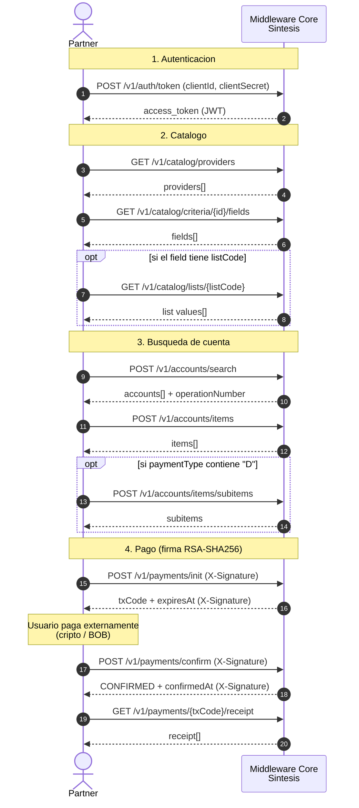

# Middleware Core API

API REST para integrar el servicio de cobros de Genesis a traves de Middleware Core.

## Ambientes

| Ambiente | Base URL |
|----------|----------|
| **Stage** | `https://stage-api.sintesis.com.bo/middleware-core` |
| **Produccion** | `https://api.sintesis.com.bo/middleware-core` |

## Flujo de integracion

1. **Autenticacion** — Obtene un token JWT intercambiando tus credenciales `clientId` / `clientSecret` en el endpoint `POST /v1/auth/token`.
2. **Catalogo** — Consulta departamentos, categorias, proveedores, grupos y criterios de busqueda disponibles.
3. **Busqueda de cuenta** — Busca una cuenta por proveedor y criterio. Obtene los items (deudas) disponibles para pagar.
4. **Pago** — Inicia un carrito con los items seleccionados y confirma el pago. Descarga el comprobante.

### Secuencia del flujo de pago



## Autenticacion

Todos los endpoints (excepto `POST /v1/auth/token`) requieren un token JWT en el header:

```
Authorization: Bearer <access_token>
```

## Formato de errores

Los errores siguen el estandar [RFC 7807 (Problem Details)](https://www.rfc-editor.org/rfc/rfc7807):

```json
{
  "type": "https://middleware-core.sintesis.com.bo/problems/{error-type}",
  "title": "Human-readable title",
  "status": 422,
  "detail": "Descripcion detallada del error",
  "errorCode": "ERROR_CODE",
  "timestamp": "2026-04-10T13:28:39.450Z"
}
```

### Codigos de error

| `errorCode` | HTTP Status | Descripcion |
|-------------|-------------|-------------|
| `VALIDATION_ERROR` | 400 | Campos requeridos faltantes o invalidos |
| `MISSING_SIGNATURE` | 400 | Header `X-Signature` ausente |
| `UNAUTHORIZED` | 401 | Token JWT ausente, expirado o invalido |
| `INVALID_SIGNATURE` | 401 | Firma RSA-SHA256 invalida |
| `FORBIDDEN` | 403 | Client no registrado como API key |
| `PARTNER_INACTIVE` | 403 | Partner inactivo |
| `TRANSACTION_FORBIDDEN` | 403 | Transaccion pertenece a otro partner |
| `TRANSACTION_NOT_FOUND` | 404 | Transaccion no encontrada |
| `TRANSACTION_EXPIRED` | 408 | Transaccion expirada por volatilidad |
| `IDEMPOTENCY_CONFLICT` | 409 | Misma idempotencyKey con diferente payload |
| `INVALID_TRANSACTION_STATE` | 422 | Estado de transaccion invalido |
| `GENESIS_ERROR` | 422 | Genesis rechazo la operacion (ver `genesisCode`) |
| `EXCHANGE_RATE_UNAVAILABLE` | 503 | Currency Engine no disponible |
| `SERVICE_UNAVAILABLE` | 503 | Servicio no disponible |
| `GENESIS_UNAVAILABLE` | 503 | Genesis no disponible |
| `GENESIS_TIMEOUT` | 504 | Genesis no respondio a tiempo |
